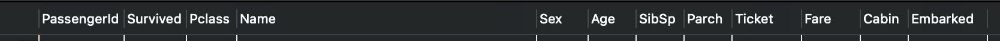
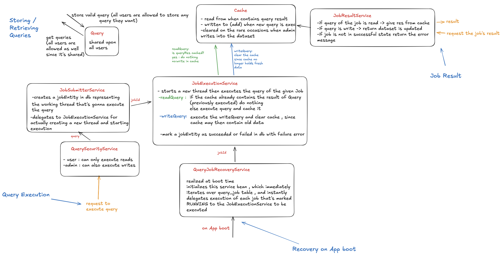
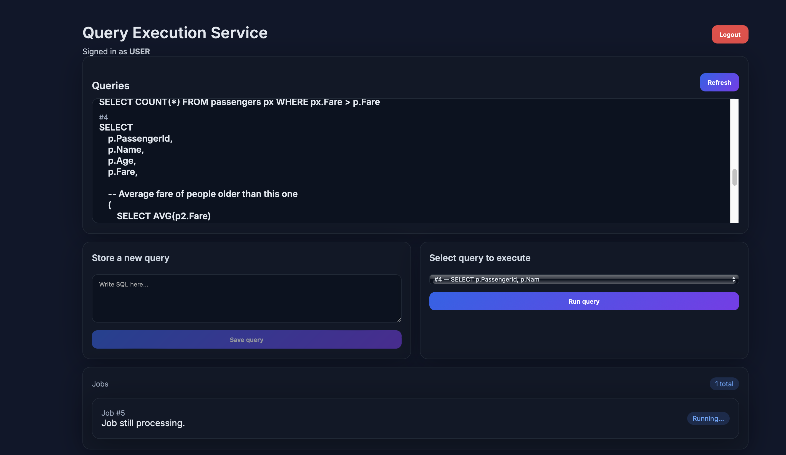
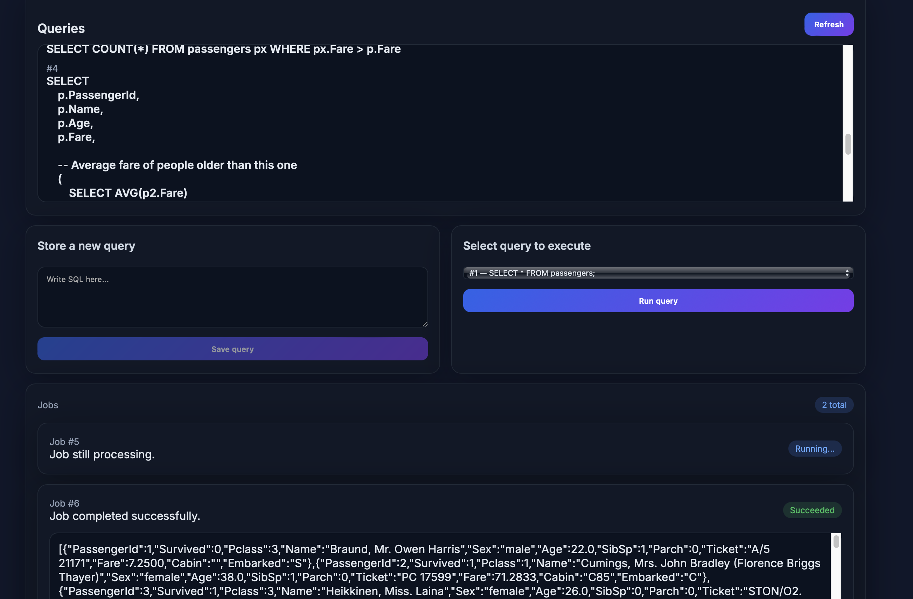
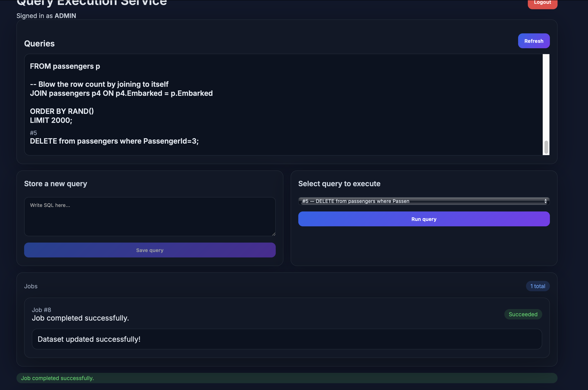
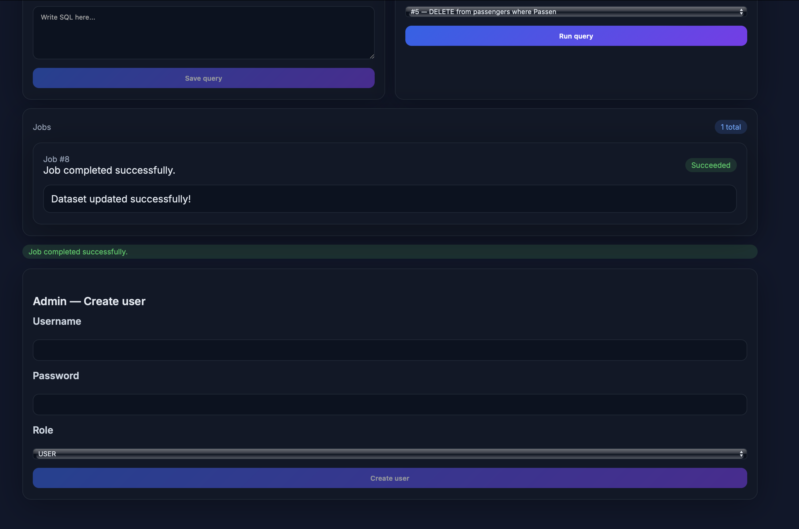

# Query Execution Service

## Intro
The Query Execution Service is a backend-focused data-engineering tool that allows users within a company to submit, track, and execute SQL queries on shared datasets. All users can view each other’s submitted queries, but access levels control who is allowed to actually run them. To optimize performance in scenarios where the underlying dataset changes infrequently, the service transparently caches results of repeated queries. Every execution is processed as an asynchronous job, which produces and returns the final result once completed—either freshly computed or served directly from the cache when appropriate.

## Features
- **Query Storage** — users can store SQL queries that are visible across the workspace.
- **Role-Based Access Control** — admins can execute write queries, while standard users are limited to read-only SQL.
- **Asynchronous Job Execution** — each query is run as an independent job so requests never block while execution finishes.
- **Result Caching** — responses are cached in-memory (simple concurrent hash map) and cleared when admins execute write queries that alter the dataset.
- **Error-Resilient API** — backend validates inputs, enforces limits, and safely handles SQL (only dataset-related queries are accepted).
- **Job History** — users can inspect past jobs and view results at any time.
- **Admin Management Tools** — admins can register new users.
- **Frontend Demo UI** — lightweight React interface for inspecting queries, jobs, and results.

## System overview
A simple monolithic app serves Vite-compiled React code directly from the backend. Authentication uses JWT with SHA-256, while the frontend stores tokens in memory for simplicity. Password hashes are generated with bcrypt factor 10. The backend persists data in MySQL, including the Titanic passengers dataset plus application-specific tables for queries, jobs, and users.

**Key entities**
- `query(id, text)`
- `query_job(id, query_id, status, error)`
- `users(id, username, password_hash, role)`  

## Dataset
- a simple "passengers" table in the same database as the Key entities. This the schema of it so users can use it.
    

## Tech stack
- React for the frontend (built with Vite)
- Spring Boot for the backend
- MySQL as the persistence layer
- Docker

- The backend codebase follows an extensible, modular structure with clear separation between controllers, services, repositories, and domain logic. The goal is to keep the system easy to test, maintain, and extend.
## Testing
- used a mix of :
- unit tests : test separate layers while mocking heavy classes like mocking repository to check service's behavior in a light way
- integration tests: those are tests that truly interact with the database , like RecoveryTest (on App boot , job at RUNNING state get rescheduled for execution)
- E2E tests: separated into AdminE2E and UserE2E , where full normal flow , invalid queries and permissions are tested
## Setup
1. Install Docker.
2. Clone the repository.
3. Run `docker compose up --build`.
4. Access the frontend at `http://localhost:8080/` (change the left-hand side of the port mapping in `docker-compose.yml` if 8080 is busy).

**Demo accounts**
- `user` / `user123` (role: user)
- `admin` / `admin123` (role: admin)

The MySQL database is preloaded with the Titanic passengers dataset in a `passengers` table.

## Limitations
- The frontend keeps tokens in memory and does not use http-only cookies; it is intended as a demo helper UI.
- The in-memory cache suits a monolith but would not work for multi-server deployments (a shared cache like Redis would be needed).
- Cache eviction is not yet implemented.
- Observability is limited.
- no CI/CD pipelines yet

## UI previews
### User account

### Admin account

