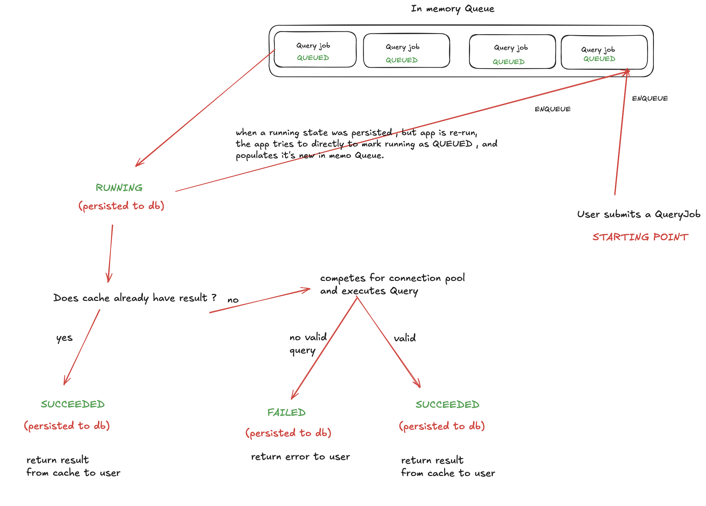

## high level idea :
When a user submits a query to be executed, the request does not wait for the query to finish.
Instead, the system immediately creates a QueryJob — a background task that will execute the query asynchronously — and returns its unique job ID to the user.
The Query should be read only . This should be secured by having a database account that respects application's privileges (as shown in README), we are also
using queryForList() for executing queries , which by default only supports read only queries .

The user can later request the result of that job using the same job ID:
If the job’s status is SUCCEEDED or FAILED, the system returns the final result (or the error message).
If the job is still QUEUED or RUNNING, the system informs the user that the result is not yet ready.
Each job would look up the cache for already existing results , if not , it will execute the SQL.
## how important is this idea ? 
the idea of async communication and caching results is especially helpful in OLAP systems context , where a query can take multiple seconds to execute. hence
blocking requests and recomputing SQL each time would give a painful user experience and saturate our server very quickly.

 
## high level architecture idea:
For simplicity, this demo assumes that the Titanic dataset is stored together with the query and query_job tables in the same MySQL database.
In a real production setup, however, analytical datasets like the Titanic data would typically be stored in a dedicated OLAP (analytical) database, optimized for large-scale query processing.
This simplification is intentional for demonstration purposes, and its implications are discussed later in the Limitations section.
We are also using an in memory ConcurrentHashMap<> data structure as our cache.
## architecture diagram
 

## mini recovery idea
as you might have noticed in the diagram , a persisted RUNNING state can land again in QUEUED state . this happens when the app crashes , so on re-run we should modify all running jobs to queued , and populate our in memo queue.
this is part of the dispatcher's work that's explained later !

## entities :
throughout the app  
- Query: entity which just consists of (id,text)
- QueryJob: an abstraction for a thread who is going to execute the query asynchronously

## roles of java classes :
## Core:
- AsyncConfig : A configuration class that defines the thread pool used for asynchronous query execution.
  Every QueryJob submitted to the system competes for a thread from this pool to perform its background work.
- JobExecutionService : Handles the complete lifecycle of a single QueryJob.
  Its main @Async method runs in a background thread and performs the following steps:
  1. Marks the job as RUNNING in the database.
  2. Checks whether the result already exists in the cache.
  3. Executes the SQL query if needed.
  4. Updates the final job state to SUCCEEDED or FAILED.
- QueryJobDispatcher : Starts automatically when the application context is initialized.
  It maintains a single consumer thread that continuously monitors the in-memory queue and delegates each queued job to the JobExecutionService.
  On startup, it also reloads unfinished jobs from the database — specifically those that were persisted in QUEUED or RUNNING states — and re-enqueues them for processing.
- QueryJobSubmitterService : Acts as the producer for the dispatcher’s queue.
  Whenever a user submits a query to be executed, this service creates a new QueryJob entry in the database and enqueues its ID for asynchronous execution.
- QueryResultCache/InMemoryQueryResultCache :A lightweight in-memory key–value cache for storing query results.
  The cache interface allows easy replacement with other caching solutions (e.g., Redis) in the future.
- QueryService :simple service layer that persists Query entities through the QueryRepository.
## Repository:
- QueryRepository : responsible for database interaction concerning the "query" table
- QueryJobRepository : responsible for database interaction concerning "query_job" table
## API:
- Exposes REST API endpoints that users interact with:
- POST /queries – Stores a new SQL query.
- GET /queries – Lists all saved queries.
- GET /queries/execute?queryId=1 – Submits a query for asynchronous execution and returns a job ID.
- GET /queries/job/{jobId} – Retrieves the result of a specific job.
  If the job has SUCCEEDED or FAILED, returns the result or error.  
  If the job is still QUEUED or RUNNING, returns a “still processing” response.
## Assumptions and limitations 
- ## Single-node architecture
  The current design assumes a single JVM instance is running.
  In a multi-node environment, each instance would maintain its own in-memory cache, leading to frequent cache misses when a load balancer distributes requests across nodes.
  A real-world solution would be to replace the local cache with a centralized caching service such as Redis.
- ## Was the database decision right ? 
  Not entirely — it was a deliberate simplification for this demo.  
  In a real-world setup, the system would ideally use two different types of databases, each specialized for a distinct workload:
  Analytical Dataset (e.g., Titanic data):  
  This belongs in an OLAP database such as ClickHouse, which is a columnar storage system optimized for heavy, read-intensive analytical queries.
  OLAP engines excel at scanning millions of rows efficiently and providing high throughput for aggregation-style operations.
  However, they are less suited for frequent write operations or transactional consistency.  
  Application Metadata (queries and job states):
  The query and query_job tables are more transactional in nature — they involve many small inserts, updates, and reads.
  For this type of workload, an OLTP database such as PostgreSQL or MySQL is a better fit, as these systems are optimized for low-latency, concurrent read/write operations.
- ## Thread pool configuration
  The number of threads in the executor pool was chosen empirically and is not optimized for maximum throughput.
  A production setup should analyze the ratio of I/O-bound to CPU-bound operations and tune the pool size accordingly.
- ## Database privileges
  The application assumes that the configured MySQL user account has appropriate privileges on the database. These privileges enforce read-only access to the analytical dataset. In a more robust implementation, the system should include a startup validation mechanism to verify correct privilege assignments.
- ## Read-only dataset
  The current version enforces a read-only dataset for simplicity.
  In a realistic environment, administrators would have full read/write access, while regular users would be limited to querying.
  Implementing authentication and authorization would be essential to achieve this separation.
- ## Testing and performance evaluation
  The existing tests cover the main functional paths, but edge cases and high-concurrency scenarios still need further coverage.
  Additionally, load testing would be crucial to validate performance under realistic workloads.
  For this, tools such as Locust can be used to simulate concurrent user behavior and monitor response times through its web-based UI.

